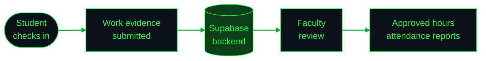
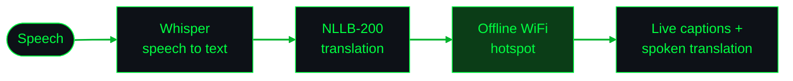
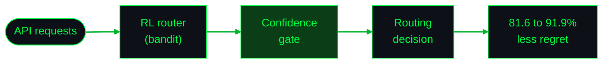

  

  
  
  

- 🎓 B.Tech Information Technology at GTBIT (GGSIPU), New Delhi. CGPA 8.75/10
- 💼 DSA & AI research intern at **Zipbolt Innovations**, data analyst intern at **AICTE**
- 🦀 Contributing to **kornia-rs**
- 🔭 Into computer vision, agentic AI & RAG, and reinforcement learning

### RAVS (Research Connect)
Role-based research attendance and verification app. **I built the backend** on Supabase (auth, database, storage). Students check in to lab sessions and submit work evidence, faculty review and approve hours, and approved hours feed attendance reports.

### DwaniLive
Offline live speech translation and accessible captioning, running on the presenter's device with no internet. Accepted into the **Sarvam**, **GitLab** and **MongoDB** Startup Programs.

### CGAR: Confidence-Gated Adaptive Routing ([SSRN](https://papers.ssrn.com/sol3/papers.cfm?abstract_id=7206758))
Published research on RL-based API gateway routing under autoscaling.

**[kornia-rs](https://github.com/kornia/kornia-rs)**: computer vision in Rust, with Python bindings

- 🐛 Fixed a doctest-discovery gap where docstrings were silently skipped in recursive test collection
- 🧨 Resolved an aliasing UB bug in the fused `ColorJitter` path
- 🛡️ Replaced panics with proper Python exceptions for malformed inputs

  
    
  
  
  
  
  
  
  
  
  
  
  

  
  

  

 

  

 

  

| | |
| :-- | :-- |
| 🥇 **Rank 1, Perfect 100** | ICTRD Data Science Program (2025) |
| 🎨 **Winner** | Ctrl+Alt+Design, IEEE DTU x IEEE GTBIT (2025) |
| 🚀 **Accepted** | Sarvam, GitLab and MongoDB Startup Programs |
| 📖 **Published** | CGAR on SSRN |

