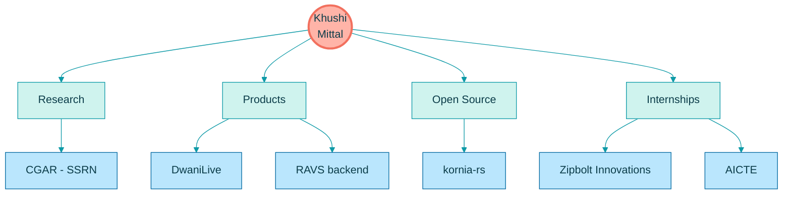
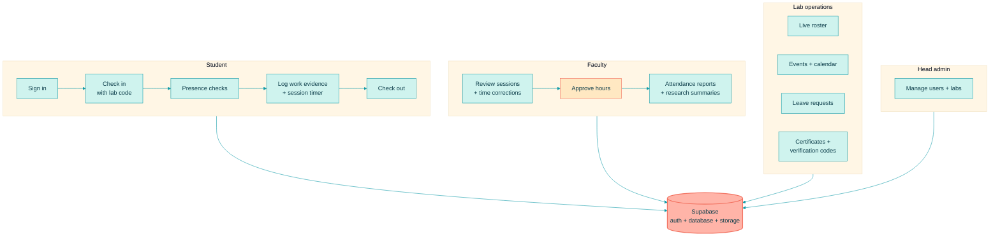
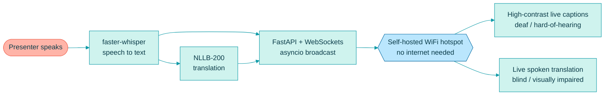
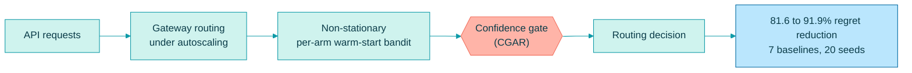
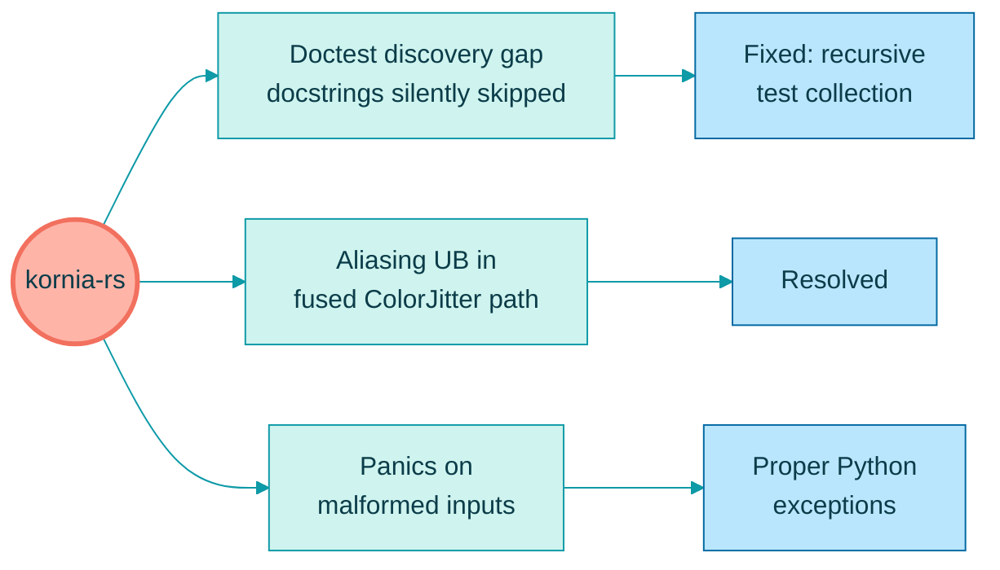
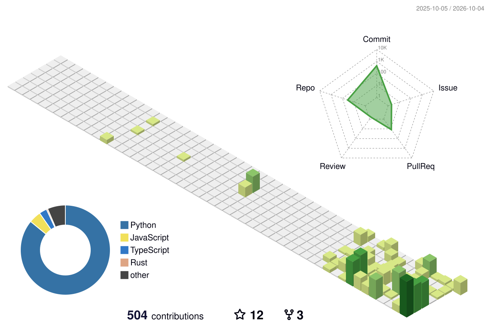
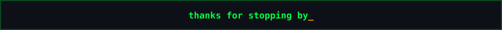

  

  
  
  

  

### 🧭 The whole map

### 🎓 RAVS (Research Connect): I built the backend
A role-based **research attendance and verification** app. Students authenticate, check in and out of lab sessions and submit work evidence. Faculty review those sessions before approved hours count toward attendance reports. Admins manage users and lab configuration. Also covers presence checks, events, leave, certificates and a live roster. **Supabase** provides auth, database and storage.

### 🗣️ DwaniLive: offline live translation + accessible captions
Runs on the presenter's device with **zero internet dependency**. Accepted into the **Sarvam**, **GitLab** and **MongoDB** Startup Programs.

**CGAR: Confidence-Gated Adaptive Routing for RL-Based API Gateways** · [📄 SSRN](https://papers.ssrn.com/sol3/papers.cfm?abstract_id=7206758)

**[kornia-rs](https://github.com/kornia/kornia-rs)**: computer vision in Rust, with Python bindings

  
   
  

  
  

  

 

  

 

  

| | |
| :-- | :-- |
| 🥇 **Rank 1, Perfect 100** | ICTRD Data Science Program (2025) |
| 🎨 **Winner** | Ctrl+Alt+Design, IEEE DTU x IEEE GTBIT (2025) |
| 🚀 **Accepted** | Sarvam, GitLab and MongoDB Startup Programs |
| 📖 **Published** | CGAR on SSRN |

 

