

  

  
  
  

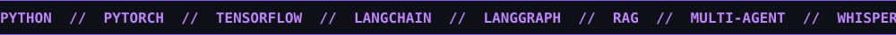


  


### 🧭 The whole map

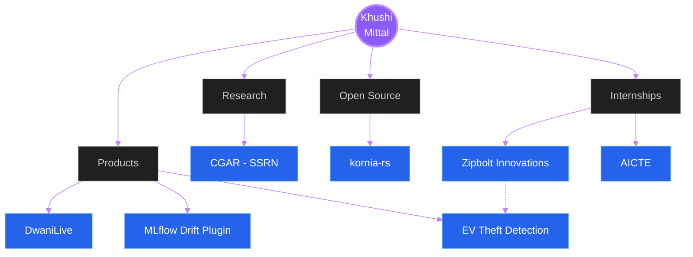

### 🗣️ DwaniLive: offline live translation + accessible captions
Runs on the presenter's device with **zero internet dependency**. Accepted into the **Sarvam**, **GitLab** and **MongoDB** Startup Programs.

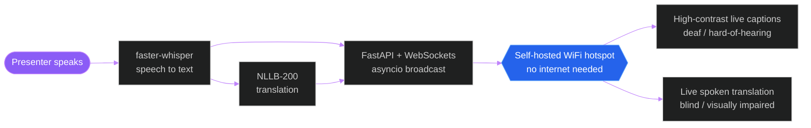

### 📉 MLflow Drift Plugin: compliance-mapped drift detection
**31 passing tests.** Maps drift to RBI's draft 2026 Model Risk guidance and DPDP Act Sec. 8(3)-(4), which US tools like Arize and Evidently don't do.

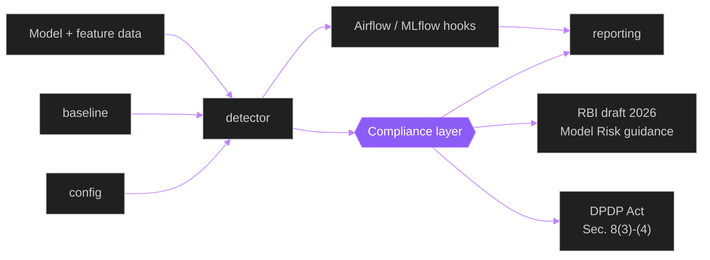

### 🚗 EV Theft Detection: Raspberry Pi security
Built during my research internship at Zipbolt Innovations.

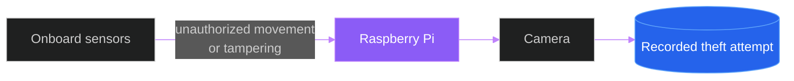


**CGAR: Confidence-Gated Adaptive Routing for RL-Based API Gateways** · [📄 SSRN](https://papers.ssrn.com/sol3/papers.cfm?abstract_id=7206758)

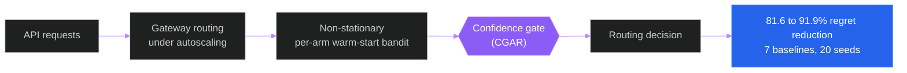


**[kornia-rs](https://github.com/kornia/kornia-rs)**: computer vision in Rust, with Python bindings

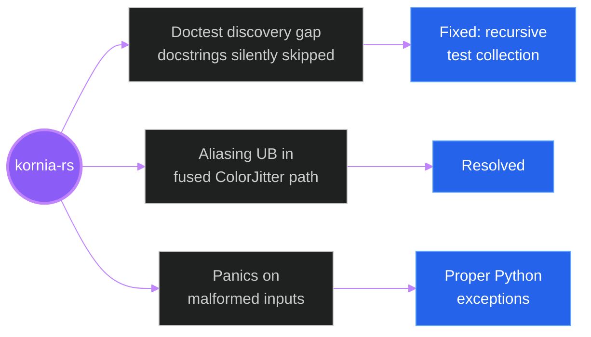


  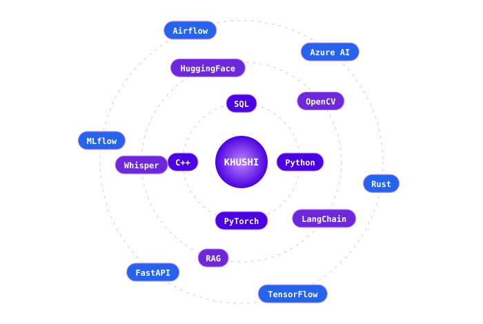
   
  


  
  

  

 

  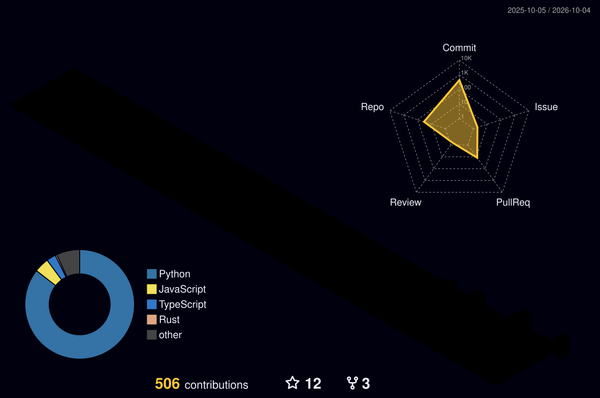

 

  <picture>
    <source media="(prefers-color-scheme: dark)" srcset="https://raw.githubusercontent.com/khushi-070906/khushi-070906/output/github-snake-dark.svg" />
    <source media="(prefers-color-scheme: light)" srcset="https://raw.githubusercontent.com/khushi-070906/khushi-070906/output/github-snake.svg" />
    
  </picture>

| | |
| :-- | :-- |
| 🥇 **Rank 1, Perfect 100** | ICTRD Data Science Program (2025) |
| 🎨 **Winner** | Ctrl+Alt+Design, IEEE DTU x IEEE GTBIT (2025) |
| 🚀 **Accepted** | Sarvam, GitLab and MongoDB Startup Programs |
| 📖 **Published** | CGAR on SSRN |

 

