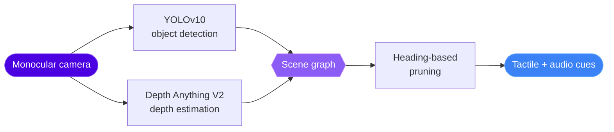

  

  
  
  

  

### 👁️ V2T-Graph / VisionSense — *Patent Pending*
A monocular camera becomes a navigation aid for visually impaired users. Part of **SmartSight**, an AI + IIoT platform (ESP32 sensors, bone-conduction audio, multilingual voice, OCR, SOS alerts).

<b>🗣️ DwaniLive</b>: offline live speech translation + accessible captioning

 

Runs on the presenter's device and broadcasts over a self-hosted WiFi hotspot with **zero internet dependency**. Real-time high-contrast captions for deaf and hard-of-hearing attendees, live spoken translation for blind and visually impaired attendees.

`Python` `FastAPI` `faster-whisper` `NLLB-200` `WebSockets` `asyncio`

🚀 Accepted into the **Sarvam**, **GitLab** and **MongoDB** Startup Programs.

<b>📉 MLflow Drift Plugin</b>: compliance-mapped drift detection

 

MLflow/Airflow plugin for model and feature drift (detector, baseline, config, hooks, reporting), backed by **31 passing tests**. Maps drift to **RBI's draft 2026 Model Risk guidance** and **DPDP Act Sec. 8(3)-(4)**, which US tools like Arize and Evidently don't do.

`Python` `MLflow` `Airflow`

<b>🚗 EV Theft Detection</b>: Raspberry Pi security system

 

Camera records theft attempts while onboard sensors detect unauthorized movement and tampering. Built during my research internship at Zipbolt Innovations.

**CGAR: Confidence-Gated Adaptive Routing for RL-Based API Gateways** · [📄 SSRN](https://papers.ssrn.com/sol3/papers.cfm?abstract_id=7206758)

| Problem | Approach | Result |
| :--- | :--- | :--- |
| API gateway routing under autoscaling is non-stationary | Modeled as a per-arm warm-start bandit with a confidence-gated RL framework | **81.6 to 91.9% regret reduction** across 7 baselines, 20 seeds |

**[kornia-rs](https://github.com/kornia/kornia-rs)**: computer vision in Rust, with Python bindings

- 🐛 Fixed a doctest-discovery gap where docstrings were silently skipped in recursive test collection
- 🧨 Resolved an aliasing UB bug in the fused `ColorJitter` path
- 🛡️ Replaced panics with proper Python exceptions for malformed inputs

 

 

  

  
  

  

 

  

 

  <picture>
    <source media="(prefers-color-scheme: dark)" srcset="https://raw.githubusercontent.com/khushi-070906/khushi-070906/output/github-snake-dark.svg" />
    <source media="(prefers-color-scheme: light)" srcset="https://raw.githubusercontent.com/khushi-070906/khushi-070906/output/github-snake.svg" />
    
  </picture>

| | |
| :-- | :-- |
| 🥇 **Rank 1, Perfect 100** | ICTRD Data Science Program (2025) |
| 🎨 **Winner** | Ctrl+Alt+Design, IEEE DTU x IEEE GTBIT (2025) |
| 🚀 **Accepted** | Sarvam, GitLab and MongoDB Startup Programs |
| 📜 **Patent pending** | V2T-Graph |
| 📖 **Published** | CGAR on SSRN |

 

